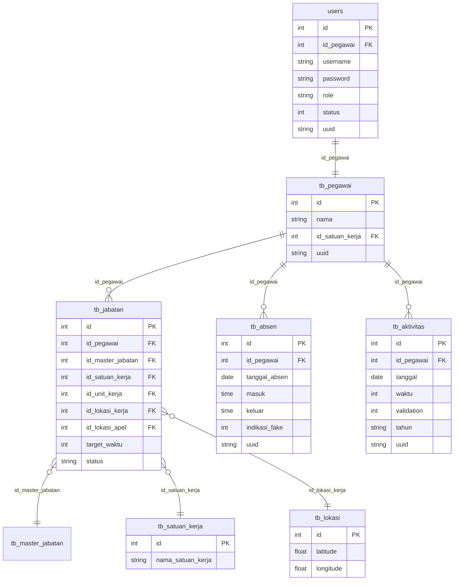

# Analisis Kode Program — newdikerjaapi

## Ringkasan Proyek

**newdikerjaapi** adalah REST API backend berbasis **Laravel 10** untuk sistem **Manajemen Kepegawaian & Presensi** (SIMASN / DiKerja). API ini melayani aplikasi mobile pegawai pemerintah daerah untuk:

- **Presensi/Absensi** digital dengan GPS & deteksi fake GPS
- **Aktivitas harian** (log kinerja pegawai)
- **Dashboard** data kepegawaian, kehadiran, kinerja, dan TPP
- **Layanan kepegawaian** (pengajuan cuti, layanan umum)
- **Profil pegawai** (update data, verifikasi wajah)
- **Laporan** export Excel (kehadiran, kinerja, TPP)
- **Sinkronisasi data** dari sistem eksternal

---

## Stack Teknologi

| Komponen | Teknologi |
|---|---|
| Framework | Laravel 10 (PHP ≥8.1) |
| Auth | Laravel Sanctum (token-based) |
| Database | MySQL (`simasn`) — remote host |
| File Storage | SFTP (remote server), Local |
| UUID | `ramsey/uuid` |
| PDF | `barryvdh/laravel-dompdf`, `mpdf/mpdf` |
| Excel | `phpoffice/phpspreadsheet` |
| Cache | Redis |
| Queue | Redis (sync mode di .env) |

---

## Arsitektur Routing — 3 Versi API

Didefinisikan di [RouteServiceProvider.php](file:///Users/zho/works/AFILA/newdikerjaapi/app/Providers/RouteServiceProvider.php):

| Prefix | File Route | Perbedaan Utama |
|---|---|---|
| `api/v1` | [api.php](file:///Users/zho/works/AFILA/newdikerjaapi/routes/api.php) | `current_user()`, `presensi()` |
| `api/v2` | [v2.php](file:///Users/zho/works/AFILA/newdikerjaapi/routes/v2.php) | `current_user2()`, `new_presensi()` |
| `api/v3` | [v3.php](file:///Users/zho/works/AFILA/newdikerjaapi/routes/v3.php) | `current_user2()`, `new_presensi2()` |
| web | [web.php](file:///Users/zho/works/AFILA/newdikerjaapi/routes/web.php) | Laporan export (tanpa auth) |

> [!IMPORTANT]
> Perbedaan antar versi hanya pada method presensi dan current_user yang dipanggil. Struktur route identik.

### Route Groups (berlaku di semua versi)

```
Public Routes:
  POST /sign-in
  POST /row-insert-user
  POST /push-master-aktivitas
  POST /push-tpp-jabatan

Protected Routes (auth:sanctum + my-throttle):
  GET  /current-user
  GET  /waktu-server
  POST /check-gps

  /absen     → check-absen, check-absen-nakes, hapus-absen, presensi
  /profile   → update, get-image-profil, ubah-password, verifikasi-wajah, hapus-wajah
  /option    → master-aktivitas, status-kawin, golongan, pendidikan, sasaran-kinerja
  /home      → pegawai, atasan, kinerja, kehadiran, tpp, sasaran-kinerja
  /aktivitas → list, store, show, update, delete, check-menit-kinerja
  /pengumuman → list
  /layanan   → list, get-icon, list-cuti, dokumen-by-cuti, store, update, option, layanan-general
  /dokumen-pribadi → /, file-dokumen-pribadi
  POST /logout
```

---

## Controllers (12 file)

### [BaseController.php](file:///Users/zho/works/AFILA/newdikerjaapi/app/Http/Controllers/BaseController.php)
Response wrapper standar:
- `sendResponse($result, $message)` → `{success: true, message, data}`
- `sendError($error, $errorMessage, $code)` → `{success: false, message, data}`

### [LoginController.php](file:///Users/zho/works/AFILA/newdikerjaapi/app/Http/Controllers/LoginController.php) (327 lines)
- `signIn()` — Login + generate Sanctum token
- `current_user()` — Data pegawai + jabatan + kehadiran (v1)
- `current_user2()` — Versi updated (v2/v3)
- `revoke()` — Logout / hapus token

### [AbsenController.php](file:///Users/zho/works/AFILA/newdikerjaapi/app/Http/Controllers/AbsenController.php) (463 lines)
- `checkAbsen()` — Cek status absen hari ini
- `checkAbsenNakes()` — Cek absen khusus Nakes (tenaga kesehatan / shift)
- `presensi()` — Record absen v1
- `new_presensi()` — Record absen v2
- `new_presensi2()` — Record absen v3

### [HomeController.php](file:///Users/zho/works/AFILA/newdikerjaapi/app/Http/Controllers/HomeController.php) (970 lines) ⭐ Controller terbesar
- `pegawai()` — Info pegawai untuk dashboard
- `atasan()` — Info atasan langsung
- `kinerja()` — Data kinerja bulanan
- `kehadiran()` — Rekap kehadiran bulanan
- `tpp()` — Perhitungan Tunjangan Penghasilan Pegawai
- `sasaran_kinerja()` — Data SKP (Sasaran Kinerja Pegawai)
- `data_kehadiran_pegawai()` — Perhitungan detail kehadiran (250+ lines)
- `pengumuman()` — List pengumuman

### [AktivitasController.php](file:///Users/zho/works/AFILA/newdikerjaapi/app/Http/Controllers/AktivitasController.php) (259 lines)
CRUD aktivitas harian pegawai + cek menit kinerja

### [GpsController.php](file:///Users/zho/works/AFILA/newdikerjaapi/app/Http/Controllers/GpsController.php) (133 lines)
- `checkGps()` — Deteksi fake GPS menggunakan **Haversine formula**
- Threshold: 7500 meter dari titik lokasi kerja
- Jika terdeteksi fake → update `indikasi_fake` di `tb_absen`

### [LaporanApiController.php](file:///Users/zho/works/AFILA/newdikerjaapi/app/Http/Controllers/LaporanApiController.php) (1242 lines) ⭐ File terbesar
Export Excel via PhpSpreadsheet untuk:
- Laporan kehadiran pegawai (`export_rekap_pegawai`, `export_rekap_pegawai_nakes`)
- Laporan kinerja pegawai (`export_kinerja_pegawai`)
- Laporan TPP pegawai (`export_tpp_pegawai`)

### [ProfileController.php](file:///Users/zho/works/AFILA/newdikerjaapi/app/Http/Controllers/ProfileController.php) (336 lines)
- Update profil, ubah password, verifikasi & hapus wajah
- Options: status kawin, golongan, pendidikan, SKP

### [LayananController.php](file:///Users/zho/works/AFILA/newdikerjaapi/app/Http/Controllers/LayananController.php) (162 lines)
Manajemen layanan & pengajuan cuti via SFTP file storage

### [SinkronisasiController.php](file:///Users/zho/works/AFILA/newdikerjaapi/app/Http/Controllers/SinkronisasiController.php) (405 lines)
- Sync master jabatan dari sistem eksternal
- Sync data absensi
- Insert user baru + hash password

### [DokumenPribadiController.php](file:///Users/zho/works/AFILA/newdikerjaapi/app/Http/Controllers/DokumenPribadiController.php) (91 lines)
Menampilkan 16+ tabel riwayat pegawai (pendidikan, jabatan, kepangkatan, diklat, keluarga, dll.) + serve file via SFTP

---

## Models (8 file)

Semua model menggunakan UUID auto-generation pada `creating` event.

| Model | Tabel | Catatan |
|---|---|---|
| [User](file:///Users/zho/works/AFILA/newdikerjaapi/app/Models/User.php) | `users` | Sanctum tokens, fillable: id_pegawai, username, password, role, status |
| [Pegawai](file:///Users/zho/works/AFILA/newdikerjaapi/app/Models/Pegawai.php) | `tb_pegawai` | Profil pegawai |
| [Absen](file:///Users/zho/works/AFILA/newdikerjaapi/app/Models/Absen.php) | `tb_absen` | Data absensi harian |
| [Aktivitas](file:///Users/zho/works/AFILA/newdikerjaapi/app/Models/Aktivitas.php) | `tb_aktivitas` | Log aktivitas kinerja |
| [Jabatan](file:///Users/zho/works/AFILA/newdikerjaapi/app/Models/Jabatan.php) | `tb_jabatan` | Jabatan pegawai |
| [MasterJabatan](file:///Users/zho/works/AFILA/newdikerjaapi/app/Models/MasterJabatan.php) | `tb_master_jabatan` | Master data jabatan |
| [LayananCuti](file:///Users/zho/works/AFILA/newdikerjaapi/app/Models/LayananCuti.php) | `tb_layanan_cuti` | Pengajuan cuti |
| [SatuanKerja](file:///Users/zho/works/AFILA/newdikerjaapi/app/Models/SatuanKerja.php) | `tb_satuan_kerja` | Unit organisasi |

---

## Traits (6 file) — Shared Business Logic

### [General.php](file:///Users/zho/works/AFILA/newdikerjaapi/app/Traits/General.php) (892 lines) ⭐ Trait terbesar
40 fungsi utama mencakup:
- **Option helpers**: golongan, pendidikan, eselon, satuan/unit kerja, agama, jenis jabatan
- **Pegawai lookup**: `findPegawai()`, `findAtasan()`, `checkJabatan()`
- **Kehadiran**: `data_kehadiran_pegawai()` (330 lines), `isTanggalLibur()`, `isRhamadan()`
- **Kinerja**: `persentase_skp()`, `persentase_kinerja()`
- **Jabatan management**: jabatan definitif, PLT, PJ, kosong, duplikat

### [Kehadiran.php](file:///Users/zho/works/AFILA/newdikerjaapi/app/Traits/Kehadiran.php) (356 lines)
- `jumlahHariKerja()`, `jmlAlfa()`, `hitungTelat()`
- `konvertWaktu()` — Konversi waktu absen → menit keterlambatan / pulang cepat
- `konvertWaktuNakes()` — Versi khusus tenaga kesehatan (shift)
- `isRhamadan()` — Cek periode Ramadan (jam kerja berbeda)

### [Presensi.php](file:///Users/zho/works/AFILA/newdikerjaapi/app/Traits/Presensi.php) (248 lines)
Mirip `Kehadiran` trait, extended versi untuk laporan. Uses `General` trait.

### [Kinerja.php](file:///Users/zho/works/AFILA/newdikerjaapi/app/Traits/Kinerja.php) (55 lines)
- `kinerja_pegawai()` — Persentase capaian vs target waktu kerja
- `checkValidasiLimaHari()` — Validasi input max 5 hari ke belakang

### [Pegawai.php](file:///Users/zho/works/AFILA/newdikerjaapi/app/Traits/Pegawai.php) (26 lines)
- `findJabatanUser()` / `findJabatan()` — Query jabatan user + lokasi kerja & apel

### [Option.php](file:///Users/zho/works/AFILA/newdikerjaapi/app/Traits/Option.php) (25 lines)
- `status_kawin()`, `golongan_pangkat()`, `pendidikan()`
- `addJitter()` — Cache TTL jitter untuk menghindari stampede

---

## Database Schema (tabel yang teridentifikasi dari kode)



### Tabel Lain yang Digunakan (via DB Query)

| Tabel | Digunakan di |
|---|---|
| `tb_master_jabatan` | Jabatan, Sinkronisasi |
| `tb_unit_kerja` | Pegawai trait, GPS |
| `tb_lokasi` | GPS check, Pegawai trait |
| `tb_hari_libur` | Kehadiran, General |
| `tb_ramadan` | Kehadiran, General |
| `tb_layanan` | Layanan |
| `tb_layanan_cuti` | Layanan Cuti |
| `tb_layanan_general` | Layanan General |
| `tb_pengumuman` | Home |
| `tb_status_kawin` | Option |
| `tb_golongan` | Option |
| `tb_pendidikan` | Option |
| `tb_sasaran_kinerja`, `tb_master_aktivitas` | Aktivitas |
| `tb_profil_*` (16 tabel) | Dokumen Pribadi |

---

## Alur Proses Utama

### 1. Autentikasi
```
POST /sign-in → LoginController@signIn
  → Validasi username/password
  → Generate Sanctum token
  → Return token + data pegawai

Protected routes → auth:sanctum middleware → my-throttle (100k/min)
```

### 2. Presensi (Absen)
```
POST /absen/presensi → AbsenController@presensi/new_presensi/new_presensi2
  → Cek apakah hari libur (tb_hari_libur)
  → Cek apakah Ramadan (jam kerja berbeda)
  → Record waktu masuk/keluar ke tb_absen
  → Hitung keterlambatan & pulang cepat

POST /check-gps → GpsController@checkGps
  → Ambil koordinat lokasi kerja dari tb_lokasi
  → Haversine distance check (threshold 7500m)
  → Update kolom indikasi_fake di tb_absen
```

### 3. Kinerja & Aktivitas
```
POST /aktivitas/store → AktivitasController@store
  → Validasi max 5 hari ke belakang
  → Cek menit kinerja tersedia
  → Record aktivitas + waktu (menit) ke tb_aktivitas

GET /home/kinerja → HomeController@kinerja
  → Hitung total capaian (SUM waktu validated)
  → Banding dengan target_waktu jabatan
  → Return persentase prestasi
```

### 4. TPP (Tunjangan Penghasilan Pegawai)
```
GET /home/tpp → HomeController@tpp
  → Hitung komponen: disiplin kehadiran + kinerja
  → Potongan: terlambat, pulang cepat, alfa, tidak apel
  → Return nilai TPP final
```

---

## Middleware

| Middleware | Fungsi |
|---|---|
| `auth:sanctum` | Token-based authentication |
| `my-throttle` | Rate limiting 100.000 requests/menit (praktis unlimited) |

---

## File Storage

- **SFTP** digunakan untuk foto profil, dokumen cuti, icon layanan, dan file dokumen pribadi
- Path: `/sftpenrekang/...` pada remote SFTP server
- File diambil via `Storage::disk('sftp')->get()` dan disajikan langsung sebagai response binary

---

## Form Requests (Validasi Input)

| Request | Digunakan di |
|---|---|
| `LoginRequest` | Sign-in |
| `PresensiRequest` | Presensi/absen |
| `AktivitasRequest` | CRUD aktivitas |
| `ProfileRequest` | Update profil |
| `ChangePasswordRequest` | Ubah password |
| `CutiRequest` | Store/update cuti |
| `CutiUpdateRequest` | Update cuti (ada tapi mirip) |
